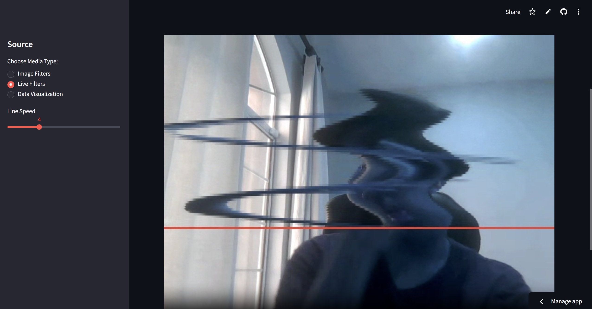

Open CV, Pandas, Matplotlib & numpy image, video, and graphing platform!
---
## Description

link: https://opencvskills-wcxmh7pkwunnqc2rrdjumx.streamlit.app/ 

Created by me!  
Do you know how computer vision works? tbh if you're here, you probably do!  
But i didn't know enough. I set out to create an app that would teach me how to use OpenCV, Pandas, Matplotlib, and Numpy!
Apart from learning what each module was and did in the dataprocessing and datavisualization folders, I used Streamlit to create a website that people can actually use these filters on!  
Create graphs!  
edit images!  
and play with video filters!  

This project was created for Hack Club's Horizons Event!    

---

## Features
* **Image Filters:** makw your image greyscale, black and white, invert it, erode, dialate, and so much more! has to be jpeg, jpg, or png
* **Live Filters:** Play with video filters, that cut the screen, act like the trending line filter, make you black and white, and more!
* **Data Visualization:** Using Pandas and Matplotlib, you can import a csv or txt file and graph values in multiple different styles! Graph, make Pie charts and more!
* **Streamlit** intuitive with sidebar navigation! 

---
## Screenshots
Main Desktop layout  

Line filter

Grayscale Image  

Graphing  

---
## Tech Stack  
There are two parts, things I used to learn and create the basic structure of the app, and the app itself.

**Streamlit app**  
requirements.txt, streamapp.py and Dockerfile were all needed to publish the app through streamlit. Streamapp.py contains almost all the code. That is what you see when you run the app.  

**Learning to code**  

Folder 1: Dataprocessing - Here is where i learned the skills to use opencv. I learned basic filters, mirroring, and more. I used two images to test some things out. myphoto.jpg, and numbers.jpeg, which are included in the file. I took both photos myself. I know im an amazing photographer no need to remind me
imageprocesing.py is for images, and numerical.py is for numbers and arrays.

Folder 2: Datavisualization - I created each element for the data visualization tab in the streamlit app by itself beforehand
it took me like a full hour but I learned a lot here. Using numpy I learned to sort
There is another filder inside this called "txtpracticefiles", which I used to test out these codes.

---
## Motivation

for my science fair project, I realized that I needed to learn open cv. In lack of any good ideas for hack club, I decided to... well, learn open cv! 
I was originally going to publish it as a python file, but realized that i need more hours for hack club so why not just use Streamlit(which ive actually used before!) and put it on the web and finish up my hours?
yeah i know its not good motivation but thats the truth so...

---
## How it works
Enter the page on https://opencvskills-wcxmh7pkwunnqc2rrdjumx.streamlit.app/   
Navigate to your chosen filter using the colapsable sidebar.    

**For image filters:**
upload an image (png, jpg, jpeg)    
Wat a few seconds    
Use the dropdown on the right to change it to whatever filter you want!  

**for Data Visualization**
navigate to data visualization using the sidebar  
Upload a CSV or TXT file with at least two columns. Use xy.txt(located in data visualization folder in this repo) if you don't have one  
chose your types of plot visualization and assign columns to values. Play around with it!

**For Live filters**
Navigate to live filters.   
After deciding what filter to use based off the dropdown menu, reload the page(to avoid any bugs)  
Click on the filter again,  
Press START!  

hint: you can modify some effects using the sliders at the top of the page under the dropdown OR on the sidebar (if they are there.) The video also records and plays back audio, so turning off your volume can give a better experience!

## Bugs
Yeah it looks like there are bugs with this app...  
For the section: live filters, there are two big issues. 
**Blue**- (They call me the opening credits of iron man 3 the way I'm blue). The video processor got all messed up because it's now on the web and it's making everything blue for some reason. It looks like the red and blue are swapping around lol
***have to reload** - I tested this on my brothers' laptop as well. For him, the image filters and data visualization worked fine, but only the line filter and black and white one seemed to work for live filters. 

# ** I found a fix! refresh the page, pick the filter, then start the camera! or else it doesnt work!**

---
## AI use and Other Resource things

AI use
Apart from google search AI summaries(if that even counts lol) for mainly syntaxes, I didn't use any generative AI to write my code. 
I did have to troubleshoot *deploying* the app with gemini, but i dont think that counts either.  
A lot of the resources I used came from numpy and opencv documentation from a coding class that I do called Youngwonks, although I completely structered everything myself!
Also used random reddit and geeks for geeks and stack overflow threads.
